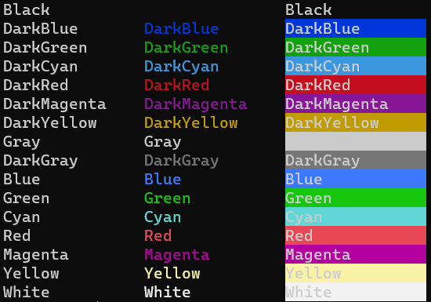

# Zápočtové úlohy

### Úloha 1
Vypište soubory sestupně dle velikosti, které jsou větší než 100000 bytů.
- [x] Checked

### Úloha 2
Modifikujte profil Powershellu tak, aby se po spuštění vypsala žlutou barvou informace o aktuální "execution policy" a zelenou barvou cesta k tomuto profilu.
- [x] Checked

### Úloha 3
Proveďte konverzi hexadecimální hodnoty řetězce do ascii.
$s = "506f7765727368656c6c20697320617765736f6d6521"
- [x] Checked

### Úloha 4
Vytvořte alias np (notepad.exe) a ct (control.exe). Exportujte je do formátu JSON. Potom oba aliasy smažte a obnovte je z JSON souboru.
- [x] Checked

### Úloha 5
V registru zjistěte, zda je pro přihlášení uživatele zapnuta klávesa Numlock. Pokud není, tak nastavte odpovídající položku registru na hodnotu 2.

Vytvořte podklíč registru HKEY_CURRENT_USER, který nazvete Hrátky s PowerShellem. V něm vytvořte hodnoty obsahující jméno vašeho uživatelského účtu, jméno počítače, aktuální datum a verzi PowerShellu. Pro potvrzení provedené akce si všechny tyto informace vypište. 
- [x] Checked

### Úloha 6
K řešení následujících úloh použijte WMI/CIM rozhraní. Zjistěte vlastnosti třídy umožňující spravovat tiskárny. Změňte umístění faxu. V informačních systémech MO se disk C: nazývá "Systém" a disk D: "Data". Zjistěte, jak se nazývá váš disk C: a případně ho přejmenujte na "Systém".
- [x] Checked

### Úloha 7
Vypište seznam nepoužitých účtů a seznam uzamčených účtů.
Použijte vhodný cmdlet a poté totéž udělejte pomocí CIM rozhraní.
- [x] Checked

### Úloha 8
Setřiďte znaky v textu “Kobyla má malý bok” vzestupně dle abecedy.

Vygenerujte 10 náhodných čísel mezi 10 a 100 vypište je spolu s jejich druhou mocninou. Výpis proveďte do dvou sloupců, kde v prvním bude hodnota čísla a v druhém jeho mocnina. Oba sloupce budou zarovnané, např. první sloupec od první pozice doprava a druhý od šesté pozice doprava.

Stáhněte si knihu z adresy https://www.gutenberg.org/ebooks/308 ve formátu UTF-8. Vypište seznam znaků, které se v textu vyskytují, a to sestupně podle počtu výskytů.
- [x] Checked

### Úloha 9
Vytvořte textový soubor obsahující text "Hello world." Pro předání parametrů použijte "splatting".

Vypište z logu System události typu "Chyba" z posledních 10 dní. Pokud v logu žádnou chybu nemáte, zkuste "Upozornění". Použijte hashtable.

### Úloha 10
Vytvořte v Powershellu interaktivní textové rozhraní, které uživateli umožní procházet adresářovou strukturu.
Vždy se zobrazí informace o obsahu adresáře, počtu souborů, minimální a maximální velikost souboru.
Vypíše očíslovaný seznam adresářů, stiskem odpovídajícího čísla přejdu do vybraného adresáře.
Stiskem klávesy U přejdu v adresářové struktuře o úroveň výš.
Stiskem klávesy Q se program ukončí. 
- [x] Checked

### Úloha 11
Vypište seznam odkazů na stránce www.novinky.cz sestupně podle počtu výskytů. Jaké číslo má sekce žena-zdraví?

Napište skript, který stáhne obrázky z vybrané galerie na pbase.com.

Vytvořte skript, který změní systémový čas počítače např. podle worldtimeapi.org.
- [x] Checked

### Úloha 12
Vytvořte skript, který oznámí, že byl spuštěn buď bez administrátorských práv, nebo s nimi. Pokud byl spuštěn bez administrátorských práv, tak se restartuje tak, aby administrátorská práva měl.

Vytvořte skript, který při vytvoření souboru ve vybraném adresáři zapíše do souboru outlog.txt informace o jméně souboru a čas jeho vytvoření. 
- [x] Checked

### Úloha 13
Vytvořte skript, který bude monitorovat obsah clipboardu a změny zapíše do textového souboru. Pokud zjistí, že clipboard obsahuje vybrané klíčové slovo, např. "heslo", tak ho barevně vypíše do terminálu.
Nainstalujte si správce hesel (KeePass, KeepasXC) a ověřte, zde je odolný vůči monitorování clipboardu.

Vytvořte skript, který vypíše co nejpodrobnější seznam nainstalovaného softwaru ve Windows. Myslí se tím, aby těch aplikací bylo uvedeno co nejvíce, aby byl seznam vytvořen z více zdrojů.
- [x] Checked

### Úloha 14
Vytvořte skript, který vykreslí paletu 16 odstínů barev přednastavených v terminálu (viz obrázek dole).

Aktualizujte si antivirovou databázi. Kolik různých hrozeb je schopen detekovat Windows Defender? Kterých hrozeb rozezná nejvíc?  
- [ ] Checked

### Úloha 15
Vytvořte skript, který bude v pravidelných intervalech ukládat obsah obrazovky do adresáře "Obrázky" v uživatelském profilu.
- [ ] Checked